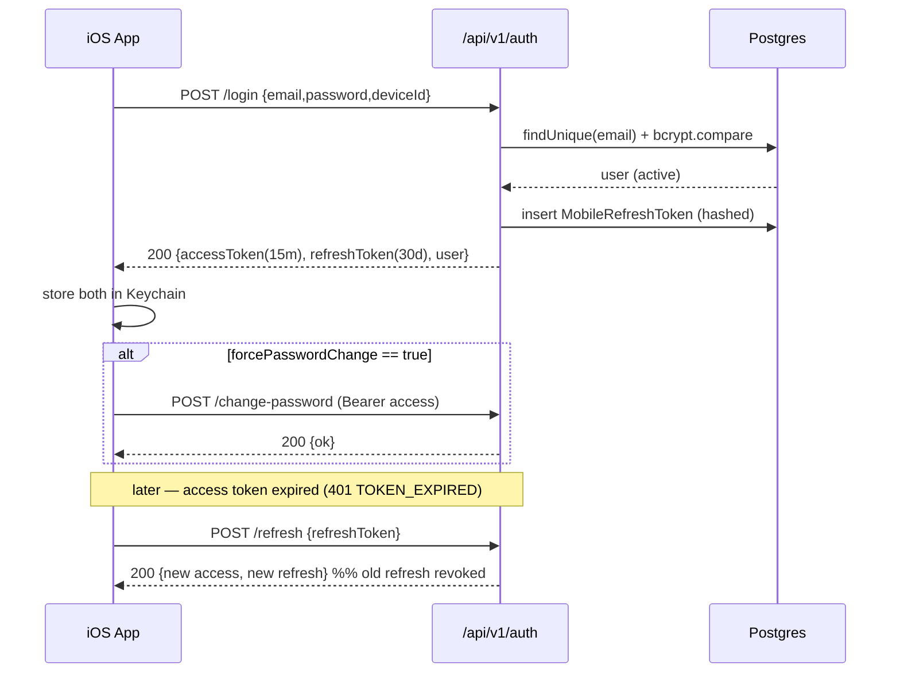

# Account & Authentication — iOS

**Status:** Draft v1.0 (handoff spec) · **Owner:** Mobile/Backend · **Last updated:** 2026-07-05

This document specifies how the iOS app authenticates as the **same user** as web, why the current web auth cannot be reused as-is on a phone, and the exact token-based auth the **web team must add**. Endpoints labeled **PROPOSED** do not exist yet; everything else is grounded in current code.

---

## 1. The shared-account model

Every asset in Voice Studio is owned by a `User` row:

- `VoiceProfile.ownerId → User.id` (see `apps/web/prisma/schema.prisma`, `voice_profiles`).
- `Generation.userId → User.id`.
- Quota lives on the user: `User.quotaMinutes`, `User.usedMinutes`.

Because the iOS app signs in as the same `User`, a profile it creates is written with the same `ownerId` the web app would use, and therefore appears on web with **zero sync logic**. The rule to preserve at all costs:

> **The mobile app must resolve to the same `User.id` that the web session would.** It authenticates the same credentials against the same `users` table. It must never mint a shadow/parallel account.

### Access rules the server already enforces (mobile inherits them for free)

From `voiceProfile.ts` and `generation.ts`:

- Profile visibility: `ownerId === user.id` **OR** `isOrgShared === true` **OR** caller is `ADMIN`/`SUPER_ADMIN`.
- Profile mutations (`requestUploadUrl`, `submitSample`, `setActiveVersion`, `delete`): **owner only** (delete also allowed for admins; locked profiles need an admin).
- Generation read/download (`get`, `getDownloadUrls`): owner only (admin can read).
- Quota: `usedMinutes + estimatedMinutes > quotaMinutes` → `403`.

The mobile token must carry the user identity so all of the above apply unchanged.

## 2. Why web auth cannot be reused directly

Current web auth (`apps/web/src/server/auth/config.ts`):

- **NextAuth / Auth.js v5**, **Credentials provider** (email + password), password hashed with **bcrypt**.
- **JWT session strategy**, delivered as an **HttpOnly, Secure, SameSite=Lax cookie**, 30-day rolling (`session.maxAge = 30 * 24 * 60 * 60`).
- Signed with `AUTH_SECRET`. Session payload exposes `user.id`, `user.role`, `user.forcePasswordChange`.
- POST to `/api/auth/*` is IP-rate-limited to **5 requests / 15 min** (`apps/web/src/app/api/auth/[...nextauth]/route.ts`).

Problems for a native client:

1. **Cookie/CSRF handshake.** NextAuth's credentials sign-in expects a CSRF token + cookie round-trip designed for a browser. A native app scraping `Set-Cookie` from `/api/auth/callback/credentials` is brittle and unsupported — it breaks whenever NextAuth internals change.
2. **No token contract.** There is no documented JSON endpoint that returns a bearer token for a native client. The JWT lives only inside an opaque cookie.
3. **The existing Bearer layer is too small.** `Authorization: Bearer vk_...` API keys exist (`ApiKey` model, sha256 → `keyHash`), but today only `POST /api/v1/generate` accepts them, and keys are minted **only** via the web tRPC `apiKey.create` UI — a user cannot obtain one from a phone. Also, `vk_` keys are long-lived with no refresh/rotation and no `forcePasswordChange` gate.

Conclusion: the web team must add a **dedicated mobile token auth**. Two viable designs follow; the **recommendation is Option A**.

## 3. PROPOSED mobile auth — Option A (recommended): password-grant with access + refresh tokens

A small, purpose-built JSON auth surface under `/api/v1/auth/*`, reusing the existing bcrypt password check and `AUTH_SECRET`-derived signing, but issuing **short-lived JWT access tokens** plus **opaque, rotating refresh tokens**.

Why this over reusing `vk_` API keys (Option B, §4): access tokens are short-lived (limits blast radius of a stolen token), refresh rotation gives revocation and theft-detection, and it cleanly models `forcePasswordChange` and logout — behaviors API keys don't express.

### 3.1 Token design

| Token | Type | Lifetime | Storage (server) | Storage (client) |
|---|---|---|---|---|
| **Access token** | Signed JWT (`HS256`, key derived from `AUTH_SECRET`) | **15 minutes** | none (stateless) | in-memory + Keychain |
| **Refresh token** | Opaque 32-byte random, sha256-hashed at rest | **30 days**, sliding, **single-use (rotated)** | new `MobileRefreshToken` row | Keychain only |

Access-token JWT claims:

```json
{
  "sub": "<User.id>",
  "role": "USER",
  "fpc": false,
  "typ": "access",
  "iat": 1751673600,
  "exp": 1751674500,
  "jti": "<uuid>"
}
```

`fpc` mirrors `User.forcePasswordChange`. The server validates the token, loads the user, and applies the same RBAC as a web session. Protected REST endpoints (see `02-…`) accept `Authorization: Bearer <access token>`.

### 3.2 PROPOSED schema addition

```prisma
model MobileRefreshToken {
  id          String    @id @default(cuid())
  userId      String
  user        User      @relation(fields: [userId], references: [id], onDelete: Cascade)
  tokenHash   String    @unique          // sha256 of the opaque refresh token
  deviceName  String?                    // "iPhone 15 Pro"
  deviceId    String                     // app-generated stable UUID (Keychain)
  familyId    String                     // rotation family; reuse-detection key
  expiresAt   DateTime
  revokedAt   DateTime?
  replacedById String?                   // set when rotated
  createdAt   DateTime  @default(now())
  lastUsedAt  DateTime?
  @@index([userId])
  @@index([familyId])
  @@map("mobile_refresh_tokens")
}
```

### 3.3 Endpoints

All are **PROPOSED**. All requests/responses are `application/json`. Errors use the shared envelope in `02-… §3`.

#### `POST /api/v1/auth/login`

Rate limit: **5 / 15 min / IP** (reuse `checkFixedWindowLimit("auth", ip, 5, 900)` — the same limiter the web `/api/auth` POST uses).

Request:
```json
{
  "email": "user@demo.demo",
  "password": "correcthorsebattery",
  "deviceId": "8B0E1C2A-…",
  "deviceName": "iPhone 15 Pro"
}
```

Response `200`:
```json
{
  "accessToken": "eyJhbGciOiJIUzI1Ni.…",
  "accessExpiresIn": 900,
  "refreshToken": "mr_9f8c…",
  "refreshExpiresIn": 2592000,
  "user": {
    "id": "clx…",
    "email": "user@demo.demo",
    "name": "Le Van A",
    "role": "USER",
    "forcePasswordChange": false,
    "quotaMinutes": 60,
    "usedMinutes": 12
  }
}
```

Errors:

| Status | `error.code` | When |
|---|---|---|
| `401` | `INVALID_CREDENTIALS` | Bad email/password, or `user.active === false` |
| `429` | `RATE_LIMITED` | Over 5/15min for the IP; include `Retry-After` |
| `400` | `VALIDATION` | Missing fields |

Server logic mirrors `authorize()` in `config.ts`: `bcrypt.compare`, reject inactive users, update `lastLoginAt`, and write an `auth.login` audit row.

> **forcePasswordChange handling.** Login **succeeds** and returns tokens even when `forcePasswordChange === true`, but `user.forcePasswordChange` is `true` in the response and `fpc: true` in the access JWT. The app must then route the user into a mandatory change-password screen and call `POST /api/v1/auth/change-password` before allowing any generation/enrollment. This matches the web gate in `config.ts` `authorized()` which redirects such users to `/change-password`. **PROPOSED:** protected write endpoints should reject calls whose token carries `fpc: true` with `403 PASSWORD_CHANGE_REQUIRED`.

#### `POST /api/v1/auth/refresh`

Request:
```json
{ "refreshToken": "mr_9f8c…", "deviceId": "8B0E1C2A-…" }
```

Response `200`: same shape as login (new access token **and** a new refresh token — rotation).

Rotation & reuse detection:

- On use, mark the presented refresh row `revokedAt` + `replacedById`, and issue a new token in the same `familyId`.
- If a **already-revoked** token is presented (replay/theft), revoke the **entire family** and return `401 REFRESH_REUSED`. The app must then force a fresh login.

Errors: `401 REFRESH_INVALID` (unknown/expired/revoked), `401 REFRESH_REUSED`.

#### `POST /api/v1/auth/logout`

Auth: Bearer access token. Body: `{ "refreshToken": "mr_…" }`. Revokes the presented refresh token (and optionally its family). Response `204`. Idempotent.

#### `POST /api/v1/auth/change-password`

Auth: Bearer access token (accepted even when `fpc: true`).

Request:
```json
{ "currentPassword": "Demo1234", "newPassword": "…min 8…" }
```

Response `200`: `{ "ok": true }`. Side effects: bcrypt-hash and store the new password, set `forcePasswordChange = false`, **revoke all other refresh families** for the user (log-out-other-devices), write an audit row. Subsequent `refresh` returns a token with `fpc: false`.

Errors: `401 INVALID_CREDENTIALS` (wrong current password), `400 WEAK_PASSWORD` (< 8 chars — match web's `z.string().min(8)`).

#### `GET /api/v1/auth/me`

Auth: Bearer access token. Returns the current `user` object (same shape as login's `user`). Used on cold start to validate a cached access token and refresh quota numbers.

#### Forgot / reset password

Web already implements `PasswordResetToken` (1 h expiry) with `/forgot-password` and `/reset-password?token=…` pages (see `../TASKS.md` P5-01). **MVP recommendation:** the app's "Forgot password?" link opens the web `/forgot-password` page in `SFSafariViewController` rather than duplicating the flow natively. A native `POST /api/v1/auth/forgot-password` / `POST /api/v1/auth/reset-password` pair is a Phase-2 nicety, not a blocker.

### 3.4 Login sequence



## 4. PROPOSED mobile auth — Option B (fallback): "sign in → mint scoped mobile key"

If the team prefers to lean on the existing `ApiKey` infrastructure instead of new token tables:

- Add `POST /api/v1/auth/login` that verifies credentials (as above) and, instead of a JWT, **mints an `ApiKey`** (`vk_…`, sha256 → `keyHash`) scoped/tagged as `source: "mobile"`, with a modest `expiresAt` (e.g. 30 days), returning the raw key **once**.
- The app stores `vk_…` in Keychain and sends it as `Authorization: Bearer vk_…` — which the existing REST layer already understands (`resolveApiKey` in `api/v1/generate/route.ts`).

Trade-offs vs Option A:

| | Option A (tokens) | Option B (mobile API key) |
|---|---|---|
| Reuses existing Bearer resolver | Needs new middleware | Yes, immediately |
| Short-lived credential | Yes (15 min access) | No (long-lived key) |
| Refresh/rotation/theft-detection | Yes | No |
| Models `forcePasswordChange` | Yes (`fpc` claim + 403 gate) | Awkward (key already valid) |
| Per-device logout | Yes | Delete the key |
| Effort | Higher | Lower |

**Recommendation: Option A.** For a voice-cloning product handling biometric-adjacent data, short-lived tokens + rotation is the industry norm and materially reduces the damage of a leaked token. Option B is acceptable only as a time-boxed MVP shortcut, and if chosen, tokens should still be given an `expiresAt` and a revoke path.

## 5. Sign in with Apple (SIWA)

### Why Credentials-only blocks pure SIWA today

The web identity model is **email + bcrypt password** with no external-IdP linkage (`User` has `passwordHash`, no `accounts` table, no OAuth provider rows). SIWA returns an Apple identity token (an opaque `sub` per app + optionally a relay email), **not** a password. There is no column to store or match an Apple `sub` against a `User`, so SIWA cannot resolve to an existing user out of the box.

### Bridge options (Phase 2)

1. **Link, don't replace (recommended).** Add a PROPOSED `AppleIdentity { userId, appleSub @unique, email }` table. Flow: user signs in once with email/password on device, then in Settings taps "Link Apple ID"; the app sends the Apple identity token to `POST /api/v1/auth/apple/link` (Bearer). Thereafter `POST /api/v1/auth/apple/login` accepts the Apple token, matches `appleSub → userId`, and returns the same token pair as §3. This keeps the invite-only, admin-provisioned account model intact — Apple is only an *additional* factor, never account creation.
2. **App Store requirement caveat.** Apple's Guideline 4.8 requires offering SIWA only if the app *also* offers third-party social logins (Google/Facebook). Voice Studio offers neither, so **SIWA is optional**, not mandatory. Treat it as a convenience feature, not a launch blocker. (See `05-… ` and `appstore-review-guard`.)

## 6. Client-side security requirements

| Concern | Requirement |
|---|---|
| **Token storage** | Access + refresh tokens stored in the **iOS Keychain** with `kSecAttrAccessibleAfterFirstUnlockThisDeviceOnly`. Never in `UserDefaults`, never in plist, never logged. `deviceId` also Keychain-persisted so it survives reinstalls-with-restore consistently. |
| **Transport** | HTTPS only. `NSAllowsArbitraryLoads` = false. **TLS certificate pinning is optional** but recommended for the internal build (pin the leaf/intermediate of the Caddy-terminated domain); make it toggleable so a cert rotation can't brick the app. |
| **Biometric app lock** | Optional user setting: gate app launch / return-from-background behind Face ID / Touch ID (`LAContext`). This is a local lock over the already-stored token, not a second auth factor to the server. |
| **Access-token refresh** | A single networking interceptor (see `04-… §4`) catches `401 TOKEN_EXPIRED`, performs one `POST /refresh`, retries the original request once, and on refresh failure clears Keychain and routes to login. Concurrent 401s must coalesce onto **one** refresh call. |
| **Logout** | Call `POST /auth/logout` (best-effort), then unconditionally clear Keychain and in-memory state. |
| **Jailbreak / paste** | Do not copy tokens to the pasteboard. Mark password fields `.textContentType(.password)` and disable screenshots on the change-password screen is not required but recommended for the internal build. |
| **No secrets in the binary** | The app ships **no** provider API keys and **no** `SERVER_SECRET`/`AUTH_SECRET`. All privileged operations go through the server. |

## 7. What the web team must build (summary)

| Item | Effort | Doc |
|---|---|---|
| `POST /api/v1/auth/login` (JSON, credential check, token pair) | M | §3.3 |
| `POST /api/v1/auth/refresh` (rotation + reuse detection) | M | §3.3 |
| `POST /api/v1/auth/logout` | S | §3.3 |
| `POST /api/v1/auth/change-password` | S | §3.3 |
| `GET /api/v1/auth/me` | S | §3.3 |
| `MobileRefreshToken` model + migration | S | §3.2 |
| Bearer-access-token middleware for all `/api/v1/*` protected routes (incl. `fpc` 403 gate) | M | §3.1 |
| (Phase 2) Apple identity link/login + `AppleIdentity` table | M | §5 |

## Changelog
- 2026-07-05: v1.0 initial account & auth spec.
