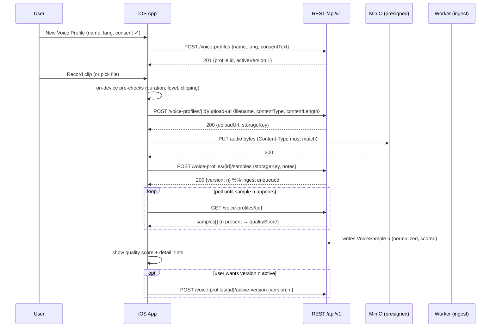

# Voice Profiles & Cloning — iOS

**Status:** Draft v1.0 (handoff spec) · **Owner:** Mobile/Worker · **Last updated:** 2026-07-05

How the iOS app manages voice profiles and drives a voice clone through the same enrollment/ingest pipeline the web app uses. Because profiles key off `ownerId`, a profile trained on iOS is immediately usable on web (and vice-versa) — see `00-… §2`.

---

## 1. Concepts (from the data model)

| Concept | Where | Meaning |
|---|---|---|
| **VoiceProfile** | `voice_profiles` | A named voice owned by a `User`. Has `lang` (`vi`/`en`/`multi`), `activeVersion`, `consent` JSON, `isOrgShared`, `isLocked`. |
| **VoiceSample** | `voice_samples` | One versioned, normalized reference clip. Has `version`, `storageKey`, `durationMs`, `sampleRate`, `qualityScore` (0–100), `qualityDetail` JSON. Unique per `(profileId, version)`. |
| **Active version** | `VoiceProfile.activeVersion` | Which sample the renderer uses. A profile is renderable only when a sample with `version === activeVersion` exists. |
| **Consent** | `VoiceProfile.consent` (JSON) | Legal record captured at profile creation: `{ signedAt, text, userId, ip, userAgent }`. |

A "voice clone" in this product = enrolling one or more reference samples into a profile. There is no separate "clone" object — cloning happens at render time inside the provider adapter, which reads the active sample. So the iOS "clone a voice" feature **is** the enrollment flow below.

## 2. Recording guidance (surface this in the UI)

The worker enrollment pipeline normalizes to **24 kHz mono, −16 LUFS**, optionally strips music (Demucs) and denoises, then VAD-trims and scores (`apps/worker/src/worker/pipelines/ingest.py`). Quality still depends heavily on the source. Show this guidance before/during recording:

| Guidance | Why (ties to scoring) |
|---|---|
| **20–60 seconds** of speech; aim for ≥ 30 s | Duration score maxes out at 30 s (`duration_score = min(duration_s/30,1)*25`). |
| **One speaker only**, no crosstalk | Diarization is not run on enrollment; multiple voices pollute the clone. |
| **No background music** | Music inflates noise floor and confuses the clone; Demucs is best-effort, not guaranteed. |
| **Quiet room**, low steady noise | Noise-floor score rewards ≤ −20 dB and below (`noise_score`), SNR score rewards ≥ ~5–30 dB. |
| **Don't clip / shout into the mic** | Clipping is penalized hard (`clipping_score = max(1 − clipping*20, 0)*20`). |
| **Natural, varied intonation** | Pitch-variance component (small weight) rewards natural prosody over monotone. |
| **Phone held ~20 cm, no wind** | Practical translation of the above for a handheld capture. |

### On-device pre-checks (before upload)

Do cheap checks locally so the user isn't surprised by a bad server score:

- **Duration gate:** warn if < 15 s, hard-encourage ≥ 30 s.
- **Level/clipping meter:** during capture show a live input meter (`AVAudioRecorder.averagePower(forChannel:)`); flag if peaks pin at 0 dBFS (clipping) or if the signal is near-silent.
- **Silence ratio:** if most frames are below a floor, prompt to re-record.
- These are *hints*, not gates — the authoritative score comes from the worker after ingest.

## 3. Consent capture — legal must-have

Voice cloning without the voice owner's consent is both a legal and platform (App Store) risk. The web app **blocks first-sample profile creation without an explicit consent checkbox** and stores the signed statement (`../TASKS.md` P1-13; `voiceProfile.create` writes `consent`). iOS must mirror this exactly.

### Requirements

1. **Explicit, unbundled checkbox.** A dedicated, unchecked-by-default control the user must tick. Do not bundle it with other agreements.
2. **Full statement text is sent** as `consentText` (min 10 chars; the web enrollment wizard sends a localized `consentText` string). The server persists it verbatim into `consent.text` alongside `signedAt`, `userId`, `ip`, `userAgent`.
3. **Owner attestation.** The statement must assert the user has the right to clone this voice (their own, or with the subject's documented permission). Recommended English text (mirror the web copy and localize to VI):

   > "I confirm that I am the owner of this voice, or I have obtained explicit permission from the voice's owner to create and use a synthetic clone of it within Voice Studio for internal content. I understand generated audio is watermarked and audit-logged, and that misuse (impersonation, deception) is prohibited."

4. **Per-profile, at creation.** Consent is captured when the profile is created (first sample), not per render. It is immutable in the `consent` JSON.
5. **Auditability.** Creation writes a `voiceProfile.create` audit row server-side; the `consent` JSON is the per-clone consent record. (See `05-…` for the recommendation to strengthen this into a fuller consent audit trail.)

## 4. Enrollment / clone flow (iOS)

The exact call sequence, mapping each step to the API in `02-…`:

Notes:

- **Audio format & encoding.** The recorder must produce a MIME in `ALLOWED_AUDIO_MIMES`. Easiest native path: record AAC in an `.m4a` container (`AVAudioRecorder`, `AVFormatIDKey = kAudioFormatMPEG4AAC`) and send `Content-Type: audio/mp4` (or `audio/x-m4a`). WAV (`audio/wav`) also works if you record LinearPCM. The worker resamples to 24 kHz mono regardless, so record at a sane rate (44.1/48 kHz) and let the server normalize. See `04-… §5`.
- **PUT header must match** the `contentType` sent to `upload-url`, or the presigned signature check fails.
- **Ingest is async.** `POST …/samples` only *enqueues*; the `VoiceSample` row (and its score) appears after the worker finishes. There is no SSE channel for ingest today — **poll `GET /voice-profiles/{id}`** until the new `version` shows up (typically seconds to a minute). A PROPOSED improvement (`05-…`) is to give ingest its own progress channel/APNs.
- **First sample auto-active.** New profiles default `activeVersion = 1`, so the first successful ingest makes the profile immediately renderable; only call `active-version` when switching between versions.

## 5. Quality scoring — surface meaningful feedback

The worker computes a 0–100 score with five weighted components (`apps/worker/src/worker/audio/quality.py`, `score_sample`). The app should show the total prominently and, when it's low, explain *which dimension* to fix using `qualityDetail`.

| Dimension | Weight | `qualityDetail` field | Good | Show this hint when weak |
|---|---|---|---|---|
| **Duration** | 25 | `duration_s` | ≥ 30 s | "Record a longer sample — aim for at least 30 seconds." |
| **SNR** | 30 | `snr_db` | ≥ ~30 dB | "Reduce background noise or move somewhere quieter." |
| **Clipping** | 20 | `clipping_ratio` | ≈ 0 | "Audio is clipping — lower mic gain / hold the phone farther away." |
| **Noise floor** | 15 | `noise_floor_db` | ≤ −20 dB (more negative = quieter) | "There's a steady background hum — turn off fans/AC and re-record." |
| **Pitch variance** | 10 | `pitch_std_hz` | natural (not extreme) | "Speak with natural intonation, not monotone." |

Score bands (recommended UI thresholds; not enforced by server):

- **≥ 80 — Excellent.** Green. Ready to render.
- **60–79 — Good.** Amber. Usable; offer "record a better one for higher fidelity."
- **< 60 — Weak.** Red. Strongly suggest re-recording; still allow use (the server does not block low scores — it only blocks profiles with *no* active-version sample).

Web parity: the web app maps these into localized remediation hints (`../TASKS.md` P3-02 — at least 5 distinct hints on snr/clipping/noise/duration/pitch). iOS should ship the same hint set in VI + EN.

## 6. Versions & active version

- Adding a sample creates the **next version** (`max(existing)+1`); it does **not** replace prior versions.
- The user chooses which version is **active** via `active-version`. Only the active version is used for rendering.
- The UI should list versions with their score + duration + date, indicate which is active, and let the owner switch or delete the profile (there is no per-sample delete API today — deletion is at the profile level).

```mermaid
stateDiagram-v2
  [*] --> Created: POST /voice-profiles (consent captured)
  Created --> Uploading: request upload-url + PUT
  Uploading --> Ingesting: POST /samples (enqueued)
  Ingesting --> Scored_vN: worker writes VoiceSample n
  Scored_vN --> Ready: sample.version == activeVersion
  Scored_vN --> AddAnother: user records another take
  AddAnother --> Uploading
  Ready --> SwitchVersion: POST /active-version {m}
  SwitchVersion --> Ready
  Ready --> Deleted: DELETE /voice-profiles/{id} (owner; admin if locked)
  Deleted --> [*]
```

## 7. Sharing, locking, deletion rules

| Rule | Behavior | Who |
|---|---|---|
| **Org-shared** (`isOrgShared`) | Shared profiles are visible to all users and usable as speakers. **Toggling is admin-only** (`setOrgShared` is `adminProcedure`) — the iOS app can *display* the flag but not set it in MVP. | Admin (web) |
| **Locked** (`isLocked`) | A locked profile (e.g. a leadership voice) can only be deleted by an admin. Owners see the lock and get `403` on delete. | Admin sets; owner blocked |
| **Delete** | Owner may delete their own unlocked profile; cascades to its samples. Locked → admin only. | Owner / admin |
| **Consent** | Immutable once set. | — |

The iOS MVP surface for these: show `isOrgShared` / `isLocked` as badges; allow delete for owned, unlocked profiles with a confirm dialog; route "share to org" / "lock" to "ask an admin" (web).

## 8. How an iOS-trained profile becomes usable on web

No special action. Because `POST /voice-profiles` writes `ownerId = <same User.id>`, and the worker ingest writes the `VoiceSample` against that profile, the profile is a first-class row in the shared Postgres. On web:

1. The user's `voiceProfile.list` returns it (owner match).
2. Its samples and scores are identical (same rows).
3. It is selectable as a speaker in web generation.

The reverse holds identically. The only cross-surface consideration is **eventual consistency during ingest**: a profile created on iOS shows on web immediately, but its first sample only appears after the worker finishes ingest — same as on web.

## 9. Edge cases & error handling

| Case | Server behavior | iOS handling |
|---|---|---|
| Upload wrong MIME | `400` "Unsupported file type" | Pre-validate against `ALLOWED_AUDIO_MIMES`; never send other types. |
| File > 100 MB | `contentLength` schema rejects (`400`) | A 60 s AAC clip is well under; block absurdly long recordings client-side. |
| PUT succeeds but app killed before `POST /samples` | Orphan object in `uploads/`; no `VoiceSample` | On relaunch, if a profile has a pending local upload, re-issue `POST /samples` with the stored `storageKey`. |
| Ingest fails on worker | No `VoiceSample` row appears | After a timeout (e.g. 2–3 min of polling), show "processing failed — try re-recording." |
| Render before ingest done | `400` "Voice profile is still processing" (`assertProfilesReady`) | Disable "Generate" until an active-version sample exists. |
| Delete a locked profile as owner | `403` "Profile is locked — contact admin" | Show the message; hide/disable delete for locked owned profiles. |

## Changelog
- 2026-07-05: v1.0 initial voice profile & cloning spec.
