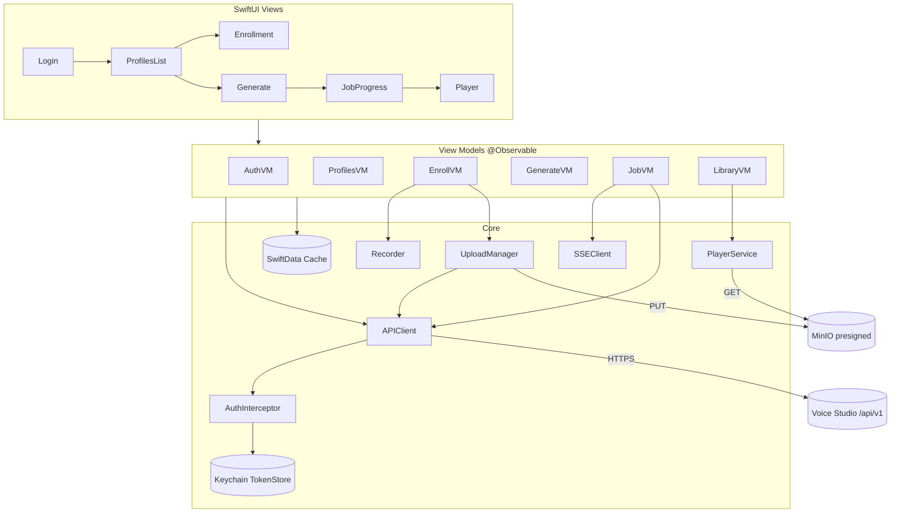
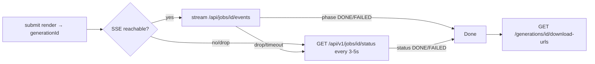
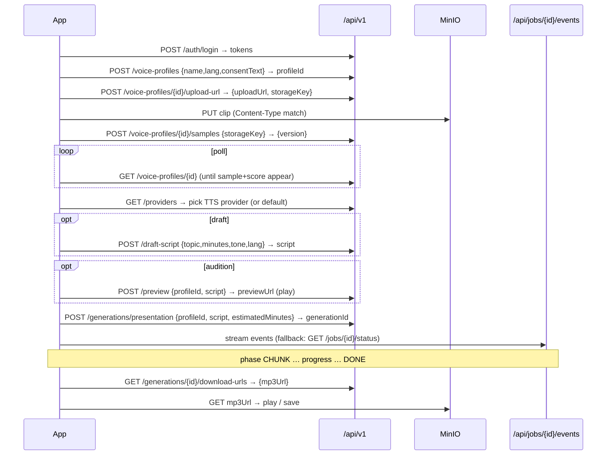

# iOS Technical Architecture

**Status:** Draft v1.0 (handoff spec) · **Owner:** Mobile · **Last updated:** 2026-07-05

Reference architecture for the native iOS app. Prescriptive enough to start coding; not tied to a specific third-party framework beyond Apple's own.

---

## 1. Stack & targets

| Layer | Choice | Notes |
|---|---|---|
| Language | Swift 6 (strict concurrency) | `async/await`, actors for shared state |
| UI | SwiftUI | `@Observable` view models (iOS 17+), `NavigationStack`, `ContentUnavailableView` for empty states |
| Min OS | iOS 17.0 | Justified in `00-… §4` |
| Networking | `URLSession` (async) | No Alamofire needed; one thin client + interceptor |
| Audio capture | AVFoundation (`AVAudioRecorder` / `AVAudioEngine`) | Record AAC/`.m4a` to match `ALLOWED_AUDIO_MIMES` |
| Audio playback | `AVPlayer` / `AVAudioPlayer` | Stream MP3 from presigned URL |
| Persistence | SwiftData (or Core Data) + Keychain | Local cache of profiles/generations metadata; tokens in Keychain |
| Background transfer | `URLSession` background config | Resilient uploads/downloads |
| Push (Phase 2) | APNs + `UserNotifications` | Job-complete notifications |
| DI | Plain initializer injection / a small environment container | Avoid heavy DI frameworks |
| Tests | XCTest + Swift Testing | Unit (view models, client), UI smoke |

No secrets ship in the binary (see `01-… §6`). The app is a pure client of the REST facade in `02-…`.

## 2. Module structure

```
VoiceStudio/
├── App/                     # @main, app-state container, routing
├── DesignSystem/            # colors (mirror DESIGN_TOKENS.md accent), typography, components
├── Core/
│   ├── Networking/          # APIClient, AuthInterceptor, Endpoint, DTOs
│   ├── Auth/                # TokenStore (Keychain), AuthService, session state
│   ├── Storage/             # presigned PUT/GET helpers, background upload manager
│   ├── Audio/               # Recorder, InputMeter, Player, format/encoding
│   └── Persistence/         # SwiftData models + cache repos
├── Features/
│   ├── Auth/                # Login, ForcePasswordChange, (Phase 2) SIWA
│   ├── Profiles/            # List, Detail, Enrollment wizard, QualityFeedback
│   ├── Generate/            # ScriptEditor, DraftWithAI, ProviderPicker, Preview, Submit
│   ├── Jobs/                # ProgressView (SSE + polling), JobState
│   ├── Library/             # Generations history, Player, Share/Download
│   └── Settings/            # Account, quota, biometric lock, logout
└── Resources/               # Localizable (vi/en), assets, Info.plist strings
```

Architecture pattern: **MV / MVVM-light**. SwiftUI `View` + an `@Observable` view model per screen; view models depend on `Core` services (protocols) so they're unit-testable with fakes.

## 3. Component diagram



## 4. Networking layer

### 4.1 APIClient

- One `APIClient` actor wrapping `URLSession`. Methods are `async throws` and return decoded `Codable` DTOs.
- Base URL + `/v1` prefix injected from config (dev vs internal-prod).
- All requests pass through the **AuthInterceptor** which attaches `Authorization: Bearer <accessToken>`.
- Decode errors, HTTP status → typed `APIError` mapping the `error.code` envelope (`02-… §3`) into a Swift enum (`.tokenExpired`, `.quotaExceeded`, `.rateLimited(retryAfter:)`, `.profileNotReady`, `.validation(msg)`, …).

### 4.2 Auth interceptor + refresh (critical)

```
send(request):
  attach access token
  resp = URLSession.data(for: request)
  if resp.status == 401 && code == TOKEN_EXPIRED:
      token = await refreshCoordinator.refresh()   // single-flight
      if token == nil: routeToLogin(); throw .unauthorized
      retry request once with new token
  return resp
```

- **Single-flight refresh:** an actor `RefreshCoordinator` ensures concurrent 401s trigger exactly **one** `POST /auth/refresh`; other callers await the same task. On success all retry; on failure Keychain is cleared and the app routes to Login.
- Refresh rotation (`01-… §3.3`): store the *new* refresh token returned by refresh. On `REFRESH_REUSED`/`REFRESH_INVALID`, force login.
- Never refresh in a loop: one attempt per original request.

### 4.3 Cold start

On launch: read tokens from Keychain → if access token unexpired, call `GET /auth/me` to validate + hydrate quota; if expired, refresh; if refresh fails, show Login. Respect `forcePasswordChange` from `/me` / login and gate the app.

## 5. Audio capture — format & encoding

The server accepts `ALLOWED_AUDIO_MIMES` and normalizes everything to 24 kHz mono −16 LUFS server-side. The app should produce a widely-supported, compact format:

| Setting | Value |
|---|---|
| Container / codec | `.m4a` / AAC (`kAudioFormatMPEG4AAC`) |
| MIME to send | `audio/mp4` (or `audio/x-m4a`) |
| Sample rate (capture) | 44100 or 48000 Hz (server downsamples) |
| Channels | Mono (1) preferred — matches the pipeline |
| Bit rate | ~128 kbps is plenty for a reference clip |

- Configure `AVAudioSession` category `.playAndRecord` (or `.record`), request mic permission with a clear `NSMicrophoneUsageDescription`.
- **Input meter:** poll `averagePower(forChannel:)` / `peakPower` during capture for the live level + clipping indicator (`03-… §2`).
- Alternative: allow **picking an existing file** via `.fileImporter` (e.g. a WAV/MP3 already on device) — validate its UTI maps to an allowed MIME before requesting an upload URL.

## 6. Uploads to presigned URLs

1. `POST /voice-profiles/{id}/upload-url` → `{ uploadUrl, storageKey }`.
2. **HTTP `PUT`** the raw bytes to `uploadUrl` with `Content-Type` **exactly equal** to what was sent (signature depends on it). No `Authorization` header on the PUT — the URL is pre-signed (3600 s validity).
3. On PUT success, `POST /voice-profiles/{id}/samples { storageKey }`.

Resilience:

- Use a **background `URLSession`** (`URLSessionConfiguration.background`) with an upload task from a file URL, so an enrollment upload survives app backgrounding. Reference-clip files are small; the main value is not dropping the upload on a network blip.
- Persist `{ profileId, storageKey, contentType }` locally *before* the PUT so an interrupted flow can resume with `POST /samples` (see `03-… §9` orphan handling).
- Video re-voice (up to 1 GB) is **out of MVP** precisely because it needs chunked/resumable large uploads — the presigned PUT is a single-object PUT and large mobile uploads are fragile. Defer to Phase 2 with a resumable strategy.

## 7. Job progress — SSE with polling fallback

Mobile networks make a single long-lived SSE connection unreliable. Strategy:



- **Primary: SSE.** Open `GET /api/jobs/{id}/events` via a `URLSession` bytes/stream task so you *can* set the `Authorization` header (preferred over `EventSource`, which can't). Parse `data:` JSON lines → `{ phase, progress, message }`. Terminal `phase ∈ {DONE, FAILED}` (and the server closes; it also hard-closes after 10 min).
- **Fallback: polling.** If SSE can't connect, drops, or the app returns from background, poll `GET /api/v1/jobs/{id}/status` (PROPOSED, `02-… §7`) every 3–5 s with jittered backoff until a terminal `status`.
- **App backgrounded during render:** don't rely on holding a socket. On foreground, immediately poll status once. For true "notify me when done," use **APNs** (Phase 2, `05-…`) rather than keeping the app alive.
- On `DONE`: fetch `download-urls`, then play/download. On `FAILED`: show `errorMessage`.

## 8. Playback

- Play MP3 from the presigned `mp3Url` (3600 s TTL — fetch it fresh when the user hits play; don't cache the URL long-term).
- Use `AVPlayer` for streaming with a scrubber, elapsed/remaining, and background-audio (`AVAudioSession .playback`, `UIBackgroundModes: audio`) so playback continues when the screen locks.
- For audiogram/video outputs (Phase 2), play `videoUrl` with `AVPlayer` in a video surface.
- Offer "Save to Files" / share sheet using the fetched URL or a downloaded temp file.

## 9. Persistence, caching, offline

| Data | Store | Policy |
|---|---|---|
| Tokens, deviceId | Keychain | `…AfterFirstUnlockThisDeviceOnly` |
| Profiles & generations **metadata** | SwiftData cache | Cache last fetch for instant cold-start render; revalidate on foreground |
| Audio bytes (finished renders) | Files (app support dir) | Optional Phase-2 "download for offline"; evict by LRU/size cap |
| In-flight upload descriptors | SwiftData/UserDefaults | For orphan/resume recovery |

Offline behavior (MVP): show cached lists read-only; any mutating action (enroll, generate) requires connectivity and surfaces a clear "You're offline" state. Presigned URLs are never persisted (they expire).

## 10. UI states, accessibility, localization

- **Every screen implements loading / empty / error / content** (mirror web DoD `B` in `../DEFINITION_OF_DONE.md`). Use `ContentUnavailableView` for empty and error.
- **Accessibility:** Dynamic Type throughout; VoiceOver labels on all controls (record button, quality badge, player transport); minimum 44×44pt touch targets; respect Reduce Motion; don't convey status by color alone (pair the quality band color with a label/icon). Parallels the web WCAG 2.1 AA bar.
- **Localization:** VI + EN via `Localizable.strings` (+ String Catalog). Vietnamese is the primary locale (`../PRD.md §8`). Mirror the web `next-intl` keys where practical, including the five quality-remediation hints. Number/date formatting via `Formatter` with the active locale.
- **Design tokens:** use the Demo accent from `../DESIGN_TOKENS.md`; light + dark mode; no hardcoded hex outside the design-system module.

## 11. Full journey — clone → generate → download (networking sequence)



## 12. Observability (client)

- **Crash + error reporting:** integrate a crash reporter (e.g. Sentry, matching web's Sentry usage) with PII scrubbing — never log tokens, emails, or script text.
- **Structured client logs** for auth-refresh, upload, and job-progress transitions (local; opt-in remote).
- **Minimal analytics** for funnel (enroll started/finished, generate started/finished) — respect Apple privacy (see `05-…` nutrition labels); no third-party ad SDKs.

## Changelog
- 2026-07-05: v1.0 initial iOS technical architecture.
