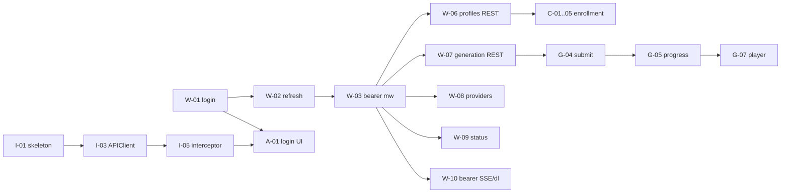

# iOS Task Breakdown

**Status:** Draft v1.0 (handoff spec) · **Owner:** Eng · **Last updated:** 2026-07-05

Sequenced, buildable backlog for the iOS app and the web-side API work it depends on. Style mirrors `../TASKS.md`: `[ ]` backlog · `[~]` in progress · `[?]` in review · `[x]` done. Every task has an ID, one-line description, dependencies, acceptance criteria (AC), and a size (S ≤ 1d · M ≈ 2–4d · L ≈ 1–2wk).

**Read before working a task:** `00-OVERVIEW.md` → the relevant contract in `02-API-CONTRACT.md` → `../DEFINITION_OF_DONE.md`.

The **Web API Enablement** epic comes first because iOS is hard-blocked on it. Sizes assume one experienced engineer per side.

---

## EPIC W — Web API Enablement (unblocks iOS)

> **Implementation status (2026-07-06).** **ALL of EPIC W (W-01…W-15) is implemented** on the web/worker side (working tree; `pnpm typecheck`, `eslint`, and `check:openapi` all clean). DB migrations `20260706000000_add_mobile_refresh_tokens` and `20260706000100_add_devices` are written but **pending apply** (`pnpm db:migrate`). W-07 reused the existing tRPC logic (exported `resolveProvider`/quota guards/`resolveLlmProvider` + a shared `draftScriptText`, mapped via `mapTrpcError`) rather than a separate service — no duplication. New surfaces: `src/server/services/{mobile-auth,push,consent}.ts`, `src/server/api/rest.ts`, `src/app/api/v1/{auth/*,voice-profiles/*,generate,generate/podcast,generate/preview,draft-script,generations/*,providers,llm-providers,devices,consent,jobs/[id]/status,openapi.yaml}`, `src/app/api/internal/job-complete`, `apps/web/openapi/openapi.yaml` + `scripts/check-openapi.mjs`; worker `_notify_job_complete` + `publish_ingest_status`. Bearer added to the shared SSE/download/export routes (SSE also gained a missing owner check). Deployment kit added: `docker-compose.prod.yml.sample`, `.env.prod.sample` (real files gitignored). Next up: EPIC I onward (native iOS — needs Xcode).

- [x] **W-01** `POST /api/v1/auth/login` — credential → token pair. · deps: none · size: M
  - AC: Valid creds return `{accessToken(15m), refreshToken(30d), user}` (`01-… §3.3`); inactive users and bad creds → `401 INVALID_CREDENTIALS`; 5/15min/IP limit; `auth.login` audit row; `lastLoginAt` updated.
- [x] **W-02** `MobileRefreshToken` model + migration + rotation/reuse detection. · deps: W-01 · size: M
  - AC: `POST /auth/refresh` rotates (old revoked, new issued in same family); replaying a revoked token revokes the family and returns `401 REFRESH_REUSED`; expiry honored.
- [x] **W-03** Bearer access-token middleware for `/api/v1/*` (+ `fpc` 403 gate). · deps: W-01 · size: M
  - AC: Middleware validates the JWT, loads the user, applies existing RBAC; `fpc:true` tokens get `403 PASSWORD_CHANGE_REQUIRED` on write routes; accepts both access tokens and legacy `vk_` keys on `/generate`. *(Shared helpers `authenticate`/`requireWrite`/`resolveLegacyApiKey` in `rest.ts`; `/generate` adaptation lands with W-07.)*
- [x] **W-04** `POST /auth/logout`, `POST /auth/change-password`, `GET /auth/me`. · deps: W-01..03 · size: S
  - AC: logout revokes refresh (idempotent, `204`); change-password re-hashes, clears `forcePasswordChange`, revokes other families, `200`; `/me` returns user+quota.
- [x] **W-05** Standard error envelope for `/api/v1/*`. · deps: none · size: S
  - AC: All new `/api/v1/*` errors return `{error:{code,message,retryAfter?}}` with the stable codes in `02-… §3`. *(Existing `POST /api/v1/generate` still uses its old `{error}` string shape — adapt it alongside W-07.)*
- [x] **W-06** Voice-profile REST facade (`list/get/create/delete/upload-url/samples/active-version/download-url`). · deps: W-03 · size: M
  - AC: Each wraps the matching `voiceProfile.*` procedure with identical validation, enums (`vi/en/multi`, `ALLOWED_AUDIO_MIMES`, 100 MB cap), ownership checks, and audit rows; responses match `02-… §6`.
- [x] **W-07** Generation REST facade (`presentation/podcast/draft-script/preview/list/get/download-urls/cancel`). · deps: W-03 · size: M
  - AC: Wrap `generation.*`; enforce rate limit (10/min), quota, `generation.maxMinutes`, profile-ready; enums (`GenKind`, `GenStatus`, tones) exact; responses match `02-… §9`. *(Prereq refactor: export shared `resolveProvider`/quota/generation-limit/`assertProfilesReady`/`resolveLlmProvider` + draft-script prompt from `generation.ts` into a service returning plain results, so both tRPC and REST reuse them without TRPCError mapping.)*
- [x] **W-08** Providers REST (`GET /providers`, `GET /llm-providers`). · deps: W-03 · size: S
  - AC: `/providers` returns enabled TTS providers + `defaultProviderId`; `/llm-providers` returns enabled LLM providers with enabled models; **no** secrets/config in payload.
- [x] **W-09** `GET /api/v1/jobs/{id}/status` polling fallback. · deps: W-03 · size: S
  - AC: Returns `{status, phase, progress, message, errorMessage, durationMs, startedAt, finishedAt, updatedAt}`; owner-scoped; reflects terminal states. *(`phase`/`message`/live `progress` are null until W-15 persists them; SSE (W-10) carries them live meanwhile.)*
- [x] **W-10** Extend SSE + download + export to accept Bearer. · deps: W-03 · size: S
  - AC: `/api/jobs/{id}/events`, `/api/download/{id}`, `/voice-profiles/{id}/export` authorize a Bearer access token (SSE also accepts a short-lived `?access_token=`); session cookie still works for web. *(Also fixed: SSE now enforces job ownership.)*
- [x] **W-11** Publish OpenAPI 3.1 spec + CI check. · deps: W-01..09 · size: S
  - AC: `02-… §10` spec extended to shipped endpoints, served at `/api/v1/openapi.yaml`, validated in CI.
- [x] **W-12** (P0 legal) Consent audit record + impersonation policy surface. · deps: none · size: M
  - AC: Consent stored as an immutable per-clone record incl. statement text/IP/UA/timestamp; AUP text returned for display at consent time; every render logs `profileIds` used.
- [x] **W-13** (P0) User-level deletion + in-app deletion request endpoint. · deps: W-03 · size: M
  - AC: `DELETE /api/v1/auth/account` (or request-flow) cascades profiles/samples/generations/storage/tokens; documented SLA; audit-logged.
- [x] **W-14** (P1) APNs device registration + worker completion hook. · deps: W-03 · size: M
  - AC: `POST /api/v1/devices` stores APNs token per user/device; terminal job status sends a push (model on existing Slack/Teams webhook).
- [x] **W-15** (P1) Ingest progress/failure channel. · deps: none · size: S
  - AC: Ingest publishes progress + terminal state (reachable via `/jobs/{id}/status` or exposed on the sample); failures are explicit.

## EPIC I — iOS Foundation

- [ ] **I-01** Xcode project, SwiftUI app skeleton, config (dev/prod base URLs), min iOS 17. · deps: none · size: S
  - AC: App builds/runs; environment switch; module layout per `04-… §2`.
- [ ] **I-02** Design system: tokens (Demo accent), typography, light/dark, base components. · deps: I-01 · size: M
  - AC: Colors mirror `../DESIGN_TOKENS.md`; Dynamic Type; no hardcoded hex outside DS.
- [ ] **I-03** APIClient + Endpoint + DTOs + typed error mapping. · deps: I-01, W-05 · size: M
  - AC: Async `URLSession` client; decodes DTOs from `02-…`; maps error envelope to a Swift `APIError` enum; unit-tested with stubbed responses.
- [ ] **I-04** Keychain TokenStore + deviceId. · deps: I-01 · size: S
  - AC: Tokens stored `…AfterFirstUnlockThisDeviceOnly`; deviceId persisted; never logged.
- [ ] **I-05** AuthInterceptor with single-flight refresh. · deps: I-03, I-04, W-02 · size: M
  - AC: Attaches access token; on `401 TOKEN_EXPIRED` performs exactly one coalesced refresh + one retry; refresh failure clears Keychain and routes to Login; concurrent 401s share one refresh.

## EPIC A — Auth (iOS)

- [ ] **A-01** Login screen + flow. · deps: I-05, W-01 · size: M
  - AC: Email/password login; loading/error states; `429` shows retry copy; on success stores tokens + routes to Profiles.
- [ ] **A-02** Forced password change gate. · deps: A-01, W-04 · size: S
  - AC: When `forcePasswordChange` (or `fpc` 403), user is forced to `change-password` before any enroll/generate; success clears the gate.
- [ ] **A-03** Cold-start session restore. · deps: I-05, W-04 · size: S
  - AC: On launch, valid token → `/auth/me` hydrate; expired → refresh; failure → Login.
- [ ] **A-04** Logout + (optional) biometric app lock. · deps: A-01 · size: S
  - AC: Logout revokes refresh + clears Keychain; optional Face ID/Touch ID gate on launch (setting).
- [ ] **A-05** Forgot-password via `SFSafariViewController` to web. · deps: A-01 · size: S
  - AC: "Forgot password?" opens web `/forgot-password`; returns to login.

## EPIC P — Profile Management (iOS)

- [ ] **P-01** Profiles list (owned + org-shared) with badges + quality. · deps: I-03, A-01, W-06 · size: M
  - AC: Lists profiles; shows `isOrgShared`/`isLocked` badges, active version, latest score; loading/empty/error states; pull-to-refresh; cached for cold start.
- [ ] **P-02** Profile detail + version list + set active. · deps: P-01 · size: M
  - AC: Shows samples with score/duration/date, active indicator; owner can set active version; sample replay via download-url.
- [ ] **P-03** Delete profile (owner/unlocked) with confirm. · deps: P-02 · size: S
  - AC: Confirm dialog; locked/owned → disabled with "contact admin"; `403` handled.

## EPIC C — Voice Cloning / Enrollment (iOS)

- [ ] **C-01** Create-profile step (name, lang, consent). · deps: P-01, W-06, W-12 · size: M
  - AC: Explicit unchecked-by-default consent gate; sends `consentText` (localized AUP); `lang ∈ vi/en/multi`; creates profile.
- [ ] **C-02** AVFoundation recorder + live input/clipping meter + on-device pre-checks. · deps: I-01 · size: M
  - AC: Records AAC `.m4a`; mic-permission string; live level + clipping/silence warnings; duration guidance (`03-… §2`).
- [ ] **C-03** File-picker enrollment path. · deps: C-02 · size: S
  - AC: Import WAV/MP3/M4A; validate UTI → allowed MIME before upload.
- [ ] **C-04** Presigned upload (background session) + submit sample. · deps: C-01, C-02, W-06 · size: M
  - AC: `upload-url` → PUT (Content-Type match) → `samples`; background session survives backgrounding; descriptor persisted for orphan/resume recovery.
- [ ] **C-05** Ingest wait + quality-score surfacing with hints. · deps: C-04, W-15 · size: M
  - AC: Poll (or ingest channel) until sample appears; show 0–100 score + band + per-dimension hints from `qualityDetail` (`03-… §5`) in VI/EN; failure state after timeout.

## EPIC G — Generation & Playback (iOS)

- [ ] **G-01** Provider picker (TTS) + default. · deps: P-01, W-08 · size: S
  - AC: Lists enabled TTS providers (localized labels); defaults to `defaultProviderId`.
- [ ] **G-02** Script editor + "Draft with AI". · deps: G-01, W-07, W-08 · size: M
  - AC: Type/paste script; draft flow (topic/minutes/tone/lang, LLM provider/model) returns script into the editor; validation (min 10 chars to submit).
- [ ] **G-03** 15-second preview. · deps: G-02, W-07 · size: S
  - AC: `preview` returns a URL; inline audition; profile-not-ready handled.
- [ ] **G-04** Submit presentation + pre-flight quota check. · deps: G-02, W-07 · size: M
  - AC: Client checks estimate vs remaining minutes; submit returns `generationId`; `403 QUOTA_EXCEEDED`/`429` handled gracefully.
- [ ] **G-05** Job progress: SSE + polling fallback. · deps: G-04, W-09, W-10 · size: M
  - AC: SSE via URLSession stream (Authorization header) parses `{phase,progress,message}`; falls back to `/jobs/{id}/status` polling on drop/background; terminal DONE/FAILED handled.
- [ ] **G-06** History list + detail. · deps: P-01, W-07 · size: M
  - AC: Paginated generations (own); shows kind/status/duration/provider; detail shows chapters/error.
- [ ] **G-07** Player + download/share. · deps: G-06, W-07 · size: M
  - AC: Streams MP3 from fresh `download-urls`; scrubber, background audio; save-to-Files/share sheet; cancel a QUEUED job.

## EPIC N — Notifications (Phase 2)

- [ ] **N-01** APNs registration + permission. · deps: A-01, W-14 · size: S
  - AC: Registers device token via `POST /devices`; requests notification permission at a sensible moment.
- [ ] **N-02** Handle job-complete push → deep link. · deps: N-01, G-05 · size: S
  - AC: Tapping a completion push opens the finished generation; failure push opens the error.

## EPIC X — Polish, Compliance, Launch

- [ ] **X-01** In-app account deletion / request flow (Apple 5.1.1(v)). · deps: A-01, W-13 · size: S
  - AC: Settings offers account deletion (or request with SLA); confirms; signs out on success.
- [ ] **X-02** Privacy: usage strings, nutrition labels, privacy-policy URL. · deps: I-01 · size: S
  - AC: `NSMicrophoneUsageDescription` + only-used permissions; nutrition labels for audio/account data; policy URL in-app.
- [ ] **X-03** Accessibility pass (VoiceOver, Dynamic Type, targets, reduced motion). · deps: all UI · size: M
  - AC: VoiceOver labels on all controls; 44pt targets; no color-only status; passes an internal a11y review.
- [ ] **X-04** Localization VI/EN complete. · deps: all UI · size: M
  - AC: All strings localized incl. error messages + quality hints; VI reviewed by a native speaker; parity with web keys where shared.
- [ ] **X-05** Crash/error reporting + minimal analytics (PII-scrubbed). · deps: I-01 · size: S
  - AC: Crash reporter live; no tokens/emails/script text logged; funnel events for enroll/generate.
- [ ] **X-06** App Store / MDM submission dry-run (appstore-review-guard). · deps: X-01..05 · size: S
  - AC: Passes the pre-submission checklist (no debug hooks, metadata matches shipped features, restore/deletion present).

---

## Critical path & milestones

| Milestone | Contents | Exit criteria |
|---|---|---|
| **MVP (internal alpha)** | W-01..11, I-01..05, A-01..03, P-01..03, C-01..05, G-01..07, X-02 | A user logs in with their web account, enrolls a voice, drafts+generates a presentation, watches progress (SSE+polling), and plays/downloads the result — all on device; profile appears on web. |
| **Beta** | + P0 legal (W-12, W-13, P0-3 watermark research), X-01, X-03..05, N-01..02 (APNs), W-14..15 | Consent/deletion/compliance in place; push notifications; a11y + i18n complete; crash reporting live. |
| **GA** | + Phase-2 features as scheduled (podcast G-editor, re-voice, audiogram playback, SIWA), P1-5/6/7 hardening, X-06 | Feature-parity for the mobile-appropriate subset; moderation + abuse hardening + observability; store/MDM submission passes review. |

## Changelog
- 2026-07-06 (later): **entire EPIC W (W-01…W-15) implemented** (web + worker); OpenAPI served + CI check wired; prod deploy kit added. Migrations pending apply.
- 2026-07-06: W-01…W-06, W-08, W-09, W-10 implemented (web side); migration pending apply. W-07 refactor prereq noted.
- 2026-07-05: v1.0 initial iOS task breakdown.
